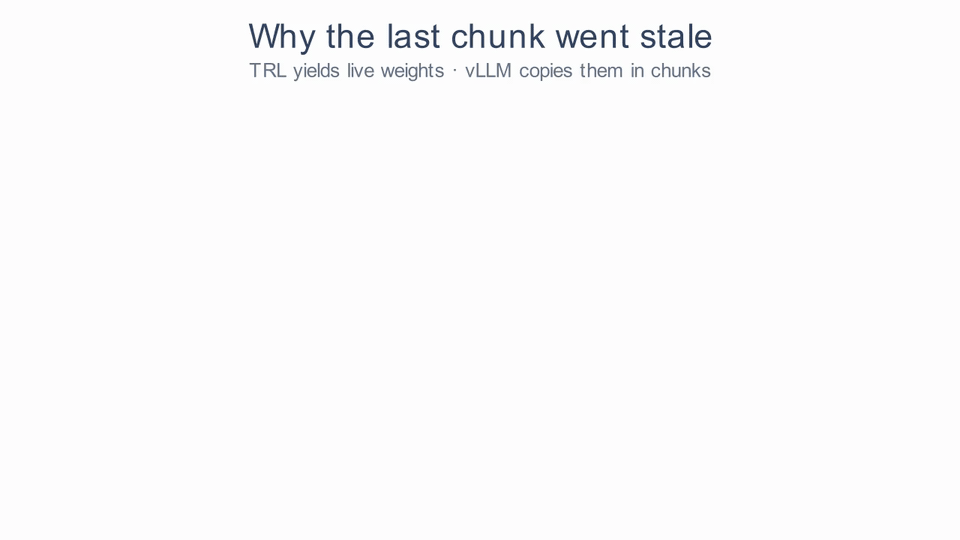

<!--
Render with setup.sh. Charts are pulled from W&B once and cached in data/.
Needs WANDB_API_KEY / WANDB_ENTITY / WANDB_PROJECT in .env on the first render.
-->

```{python}
#| label: setup
import os
from pathlib import Path

import pandas as pd
import plotly.graph_objects as go
from dotenv import load_dotenv
from plotly.subplots import make_subplots

load_dotenv(".env", override=True)
PROJECT = f"{os.environ.get('WANDB_ENTITY', 'ml-colabs')}/{os.environ.get('WANDB_PROJECT', 'rlvr-gsm8k')}"
CACHE = Path("data")
CACHE.mkdir(exist_ok=True)
STEP = "train/global_step"

# categorical slots in fixed order (validated palette); a reward keeps its color on every chart
SERIES = ["#2a78d6", "#eb6834", "#1baf7a", "#eda100", "#e87ba4", "#008300", "#4a3aa7", "#e34948"]
TEST_ACCURACY_COLOR = "#6f42c1"
GRAY = "#8a8984"  # reference lines and annotations
INK = "#3d3c38"  # total reward and single-metric panels (blue is reserved for the exact reward)
REWARDS = [  # (reward fn, legend label)
    ("exact_check", "exact (answer + format)"),
    ("correctness_check", "correctness"),
    ("lenient_correctness_check", "lenient correctness"),
    ("format_check", "format"),
    ("tag_check", "tags (partial, max 0.5)"),
    ("step_check", "steps"),
    ("solution_number_check", "answer is a number"),
]
REWARD_COLOR = {fn: SERIES[i] for i, (fn, _) in enumerate(REWARDS)}


def _lighten(color, amount=0.48):
    rgb = [int(color[i:i + 2], 16) for i in (1, 3, 5)]
    rgb = [round(c + (255 - c) * amount) for c in rgb]
    return f"rgb({rgb[0]}, {rgb[1]}, {rgb[2]})"


def history(run_id: str) -> pd.DataFrame:
    """Full-resolution W&B history for a run, cached as parquet after the first fetch."""
    f = CACHE / f"{run_id}.parquet"
    if f.exists():
        return pd.read_parquet(f)
    import wandb

    h = pd.DataFrame(wandb.Api().run(f"{PROJECT}/{run_id}").scan_history())
    h.to_parquet(f)
    return h


def run_url(run_id: str) -> str:
    return f"https://wandb.ai/{PROJECT}/runs/{run_id}"


def _xy(h, key, smooth=1, max_step=None):
    if key not in h or STEP not in h:
        return None
    d = h[[STEP, key]].dropna().sort_values(STEP)
    if max_step is not None:
        d = d[d[STEP] <= max_step]
    if d.empty:
        return None
    return d[STEP], (d[key].rolling(smooth, min_periods=1).mean() if smooth > 1 else d[key])


def _style(fig, title, height, legend_y=-0.08, bottom=20):
    fig.update_layout(
        title=dict(text=title, x=0.01, font=dict(size=15)), template="plotly_white", height=height,
        colorway=SERIES, hovermode="x unified", font=dict(size=12),
        legend=dict(orientation="h", yanchor="top", y=legend_y, x=0), margin=dict(t=70, b=bottom, l=55, r=20),
    )
    fig.update_annotations(font_size=12)
    return fig


def line(series, title, ytitle, smooth=1, log_y=False, hline=None, max_step=None):
    """One chart, several runs. series: list of (run_id, metric, label)."""
    fig = go.Figure()
    for i, (run_id, key, label) in enumerate(series):
        xy = _xy(history(run_id), key, smooth, max_step)
        if xy is None:
            continue
        fig.add_trace(go.Scatter(
            x=xy[0], y=xy[1], name=label, mode="lines",
            line=dict(width=2, color=SERIES[i]),
            hovertemplate=f"{label}: %{{y:.4f}}<extra></extra>",
        ))
    if hline is not None:
        fig.add_hline(y=hline[0], line_dash="solid", line_color=GRAY, annotation_text=hline[1], annotation_position="top left")
    _style(fig, title, 440, legend_y=-0.2, bottom=60)
    fig.update_xaxes(title_text="training step")
    fig.update_yaxes(title_text=ytitle, type="log" if log_y else None, dtick=1 if log_y else None)
    return fig


def run_grid(run_id, label, compare=None, smooth=10):
    """3x3 dashboard for one GRPO run. compare = (run_id, label) drawn in a contrasting color on a few panels."""
    h = history(run_id)
    hc = history(compare[0]) if compare else None
    titles = [
        "Total reward (train + test)", "Each reward (train + test)", "Accuracy (train + test)",
        "Groups with no signal (reward std = 0)", "Completion length (tokens)", "Entropy",
        "Gradient norm", "Importance-sampling ratio", "vLLM vs trainer |Δ log p| (nats/token)",
    ]
    fig = make_subplots(rows=3, cols=3, subplot_titles=titles, horizontal_spacing=0.07, vertical_spacing=0.11)

    def add(r, c, xy, name, color, legend=False, group=None, width=2):
        if xy is None:
            return
        fig.add_trace(go.Scatter(
            x=xy[0], y=xy[1], name=name, legendgroup=group or name, showlegend=legend,
            mode="lines", line=dict(color=color, width=width),
            hovertemplate=f"{name}: %{{y:.3f}}<extra></extra>",
        ), row=r, col=c)

    add(1, 1, _xy(h, "train/reward", smooth), "total reward", INK)
    add(1, 1, _xy(h, "eval/reward"), "total reward (test)", _lighten(INK), group="total reward")
    for fn, lab in REWARDS:
        add(1, 2, _xy(h, f"train/rewards/{fn}/mean", smooth), lab, REWARD_COLOR[fn], legend=f"train/rewards/{fn}/mean" in h, group=fn)
        add(1, 2, _xy(h, f"eval/rewards/{fn}/mean"), f"{lab} (test)", _lighten(REWARD_COLOR[fn]), group=fn)
    for fn in ("correctness_check", "exact_check"):
        lab = dict(REWARDS)[fn]
        add(1, 3, _xy(h, f"train/rewards/{fn}/mean", smooth), lab, REWARD_COLOR[fn], group=fn)
    add(1, 3, _xy(h, "eval/rewards/exact_check/mean"), "exact accuracy (test)", TEST_ACCURACY_COLOR,
        legend=True, group="exact_check", width=3)
    for (r, c), key in {(2, 1): "train/frac_reward_zero_std", (2, 2): "train/completions/mean_length", (2, 3): "train/entropy",
                        (3, 1): "train/grad_norm", (3, 2): "train/sampling/importance_sampling_ratio/mean",
                        (3, 3): "train/sampling/sampling_logp_difference/mean"}.items():
        add(r, c, _xy(h, key, smooth), titles[(r - 1) * 3 + c - 1], INK)
    if hc is not None:
        cl, last = compare[1], h[STEP].max()  # clip the comparison run to this run's length
        add(1, 1, _xy(hc, "train/reward", smooth, last), f"{cl}", SERIES[-1], legend=True, group="compare")
        add(1, 3, _xy(hc, "train/rewards/correctness_check/mean", smooth, last), f"{cl}: correctness", SERIES[-1], group="compare")
        add(3, 2, _xy(hc, "train/sampling/importance_sampling_ratio/mean", smooth, last), f"{cl}: IS ratio", SERIES[-1], group="compare")
        add(3, 3, _xy(hc, "train/sampling/sampling_logp_difference/mean", smooth, last), f"{cl}: |Δ log p|", SERIES[-1], group="compare")
    d = _xy(h, "train/sampling/sampling_logp_difference/mean")
    if d is not None and d[1].max() > 1:
        fig.update_yaxes(type="log", dtick=1, row=3, col=3)  # ticks at powers of ten
    _style(fig, f"{label} · <a href='{run_url(run_id)}'>{run_id}</a>", 900)
    fig.update_xaxes(title_text="step", row=3)
    return fig


def aux_grid(runs, metrics, title, smooth=1):
    """Small multiples for SFT / OPD runs. runs: [(run_id, label)], metrics: [(key, panel title)]."""
    fig = make_subplots(rows=1, cols=len(metrics), subplot_titles=[t for _, t in metrics], horizontal_spacing=0.06)
    for i, (run_id, lab) in enumerate(runs):
        h = history(run_id)
        for j, (key, _) in enumerate(metrics):
            xy = _xy(h, key, smooth)
            if xy is None:
                continue
            fig.add_trace(go.Scatter(
                x=xy[0], y=xy[1], name=lab, legendgroup=lab, showlegend=j == 0, mode="lines",
                line=dict(color=SERIES[i], width=2),
                hovertemplate=f"{lab}: %{{y:.4f}}<extra></extra>",
            ), row=1, col=j + 1)
    _style(fig, title, 400, legend_y=-0.3, bottom=70)
    fig.update_xaxes(title_text="step")
    return fig
```


It's been a while since I wanted to write a worklog like this, where I walk through the actual process of training models for xyz task.
So in this blog, we are gonna train a model for high school maths. And we picked Qwen2.5-0.5B as our candidate model, deliberately for two reasons:
1. It's pretty small, smallest in category of LLMs.
2. It was never trained to reason. 

So throughout this worklog, we train this *smol* model to reason, and solve maths problems.

And one more thing, it is not gonna be another tutorial where I just give you bunch of lines of code to train a model, and expect model to be 
magically SoTA, because in reality it doesn't work like that, haha. So, in case if you are new to RL, you will get a taste of how does training this models
look like.

This worklog uses code from this huggingface [tutorial](https://huggingface.co/learn/cookbook/en/trl_grpo_reasoning_advanced_reward), except system prompt is little different.


Alright, let's formalize the problem. Let's say for a question:
**Tobias is buying a new pair of shoes that costs $95. He has been saving up his money each month for the past three months. He gets a $5 allowance a month. He also mows lawns and shovels driveways. He charges $15 to mow a lawn and $7 to shovel. After buying the shoes, he has $15 in change. If he mows 4 lawns, how many driveways did he shovel?**

I want my model to respond like this:

```
<start_working_out>
He saved up $110 total because 95 + 15 = <<95+15=110>>110
He saved $15 from his allowance because 3 x 5 = <<3*5=15>>15
He earned $60 mowing lawns because 4 x 15 = <<4*15=60>>60
He earned $35 shoveling driveways because 110 - 60 - 15 = <<110-60-15=35>>35
He shoveled 5 driveways because 35 / 7 = <<35/7=5>>5
<end_working_out>
<SOLUTION>5</SOLUTION>
```


### Baselines first

Before training anything, I wanted to know where the model starts. So I wrote
the system prompt that every run in this worklog uses:

```text
You are a mathematical reasoning assistant.
When given a math problem:
1. Show the calculations and step by step solution between <start_working_out> and <end_working_out>
2. Give the final answer between <SOLUTION> and </SOLUTION>

Do not use \boxed{}. Do not write anything after </SOLUTION>.

Example:
<start_working_out>
Shelf one has 35 books and shelf two has 18.
35 + 18 = 53
<end_working_out>
<SOLUTION>53</SOLUTION>
```

The worked example and the "no `\boxed{}`" line are there for a reason. My
first version of this prompt had neither, and when I tried it on a Qwen3
model, it got 80% of the math right but wrapped 97% of its answers in
`\boxed{}` instead of the tags. A strict parser scored it 4%. One example
fixed that.

Then I ran Qwen2.5-0.5B-Instruct on the full GSM8K test set (1,319
questions) with greedy decoding, and my benchmark script printed this:

```text
accuracy (mean@1): 0.0000   (strict: script's answer format)
accuracy lenient:  0.3776   (any \boxed / #### / last number)
```

Zero. For a second I thought the model couldn't follow the format at all.
It turned out my benchmark script's "strict" check was looking for a
`#### <number>` line (from an older prompt), not the `<SOLUTION>` tags. So I
re-scored the same 1,319 answers with the checks I was actually going to
train with:

| Checks | Qwen2.5-0.5B-Instruct |
|---|---|
| right number anywhere in the answer | 37.7% |
| right number inside `<SOLUTION>` | 17.5% |
| exact tag format | 27.3% |
| right answer **and** exact format | 11.5% |

I also benchmarked Qwen3-0.6B on the test set before training. It scored 36%.

So the model can do the math on more than a third of the problems, but less
than half of those right answers land where a parser can find them. Less than half of its answers
(43%) even had a `<SOLUTION>` block. That gap between "can do the math" and
"writes it down the way I asked" kept coming back through this whole worklog.

## Getting the first run to train at all

The cookbook is written for a single consumer GPU, so it loads the model in
4-bit and lets `device_map="auto"` place it. I was on a node with 8×A100s, and
my very first run crashed before step 1:

```text
torch.OutOfMemoryError: CUDA out of memory. Tried to allocate 49.99 GiB.
```

50 GB, for a 0.5B model. It turns out the loss computes fp32 scores over
Qwen's whole 152k-token vocabulary, for every token of every completion. With
completions allowed up to 2,048 tokens and 8 of them per GPU, that one tensor
is huge. GSM8K answers are about 200 tokens long, so I cut the limit to 512.

I also dropped 4-bit (at 0.5B parameters it buys nothing on an A100) and
`device_map="auto"`, which fights `accelerate` when you want one copy of the
model per GPU. The final setup: vLLM on GPU 0 generating the rollouts, the
other 7 GPUs training, LoRA on the cookbook's `q_proj` and `v_proj`, and the
cookbook's learning rate (5e-6) and gradient clipping (0.1). I kept TRL's
default `loss_type="dapo"` for the GRPO runs.

## Naive rewards: correctness and format

My first real run, [jr8dtkxv](https://wandb.ai/ml-colabs/rlvr-gsm8k/runs/jr8dtkxv),
used the two most obvious rewards:

1. **correctness**: 1 if the number inside `<SOLUTION>` matches the answer, else 0.
2. **format**: 1 if the whole completion has the exact tag structure, else 0.

Writing even these two, I shipped two bugs on the first try. The reference
answers in GSM8K end with `#### 72`, but I was parsing them with the same
function that looks for `<SOLUTION>`, so every reference answer came out as
`None`. And TRL wants one reward per completion, but my function returned a
single number for the whole batch. Fun.

With those fixed, I trained on the full training set (7,473 questions), 8
samples per question, for 300 steps. And... nothing.

```{python}
#| label: fig-jr8dtkxv
#| fig-cap: "[jr8dtkxv](https://wandb.ai/ml-colabs/rlvr-gsm8k/runs/jr8dtkxv), correctness + format on all 7,473 training questions (10-step rolling mean)."
run_grid("jr8dtkxv", "Naive rewards, full training set")
```

Correctness started at 8.1% and ended at 7.6%. On the test set it sat at
6.8%. (Test numbers during training are sampled at temperature 1.0, so they
come in lower than the greedy 17.5% from the baseline.) Format hovered
around 20%.

So I opened the rollout table in W&B, the one TRL fills with every prompt,
completion and reward. 91% of the rollouts were wrong, and **76% of the wrong
ones had no `<SOLUTION>` block at all.** A lot of them looked like this one:

> **Q:** Pat's Pool Supply has three times as many swimming pools as Pat's
> Ark & Athletic Wear store. If Pat's Ark & Athletic Wear store has 200
> pools, how many pools do they have in total?
>
> ```text
> <start_working_out>
> Let's break this down step by step:
> ...
> 3. So, Pat's Pool Supply has 3 * 200 = 600 swimming pools.
> 4. Now, we add the number of pools both stores have: 200 + 600 = 800 pools.
>
> That means they have 800 pools altogether.
> ```

The answer is 800. The model got it right, then never closed the working-out
block and never wrote `<SOLUTION>`, so it scored zero.

The same table showed a second problem. GRPO learns by comparing the samples
within a group, so a question where all 8 samples score the same gives it
nothing to learn from. **57.5% of the groups were 0/8, and exactly one group
out of 2,114 was 8/8.**

GRPO doesn't update toward an answer just because it got a reward. It compares
each answer's reward with the other seven, using an advantage like this
[in the original GRPO formulation](https://arxiv.org/abs/2402.03300):

$$
\hat A_i = \frac{r_i - \bar r}{s_r + \epsilon}
$$

Here, $r_i$ is one answer's reward; $\bar r$ and $s_r$ are the mean and
standard deviation across the eight answers. For the correctness reward, a
0/8 group has eight zeros, so every reward equals the mean. An 8/8 group has
eight ones, and again every reward equals the mean. Either way, every
advantage is zero. The update is multiplied by that advantage, so correctness
gives the model no direction: it can't tell which answer to make more likely.
The same thing happens any time all eight answers get the same total reward.
I also had a format reward, though, so an all-wrong group could still give a
signal if some answers followed the format and others didn't.

## Filtering the 0/8 and 8/8 questions

If most questions teach nothing, why train on them? I wrote a script that
downloads a run's rollout tables from W&B, groups them per question, and
drops the questions that came out 0/8 or 8/8. [jr8dtkxv](https://wandb.ai/ml-colabs/rlvr-gsm8k/runs/jr8dtkxv) had seen
2,100 questions: 1,206 were all-wrong and 1 all-right, so 1,207 went out. I also
cut the group size from 8 to 4, to cover more questions per step, and
launched [dszbz193](https://wandb.ai/ml-colabs/rlvr-gsm8k/runs/dszbz193).

```{python}
#| label: fig-dszbz193
#| fig-cap: "[dszbz193](https://wandb.ai/ml-colabs/rlvr-gsm8k/runs/dszbz193), same rewards, 0/8 and 8/8 questions from [jr8dtkxv](https://wandb.ai/ml-colabs/rlvr-gsm8k/runs/jr8dtkxv) removed, group size 4. Comparison: [jr8dtkxv](https://wandb.ai/ml-colabs/rlvr-gsm8k/runs/jr8dtkxv)."
run_grid("dszbz193", "Filtered rollouts", compare=("jr8dtkxv", "first run"))
```

Flat again. Correctness went from 10.9% to 10.8%, test correctness stayed at
7%. This time I looked at the optimizer instead of the rewards:

```{python}
#| label: fig-gradclip
#| fig-cap: "[dszbz193](https://wandb.ai/ml-colabs/rlvr-gsm8k/runs/dszbz193): the gradient norm sits above the 0.1 clip threshold on 79% of steps, so nearly every update was scaled down."
line([("dszbz193", "train/grad_norm", "gradient norm")], "Gradient norm vs. the clip threshold", "grad norm",
     smooth=5, hline=(0.1, "max_grad_norm = 0.1"))
```

Three things were stacked against me, all straight from the cookbook's
single-GPU defaults:

- **Learning rate 5e-6.** That's a full fine-tuning learning rate. LoRA
  usually needs about 10× more.
- **Gradient clipping at 0.1.** The gradient norm averaged 0.13, so 79% of the
  steps were clipped.
- **LoRA only on `q_proj` and `v_proj`.** Very few trainable weights.

I went to 3e-5, clipping at 1.0, and LoRA on every linear layer. I also set
`lora_dropout` to 0, after the terminal showed an importance-sampling ratio of
0.16 during a test run. More on that ratio later, because it turned out to be
the biggest problem in this whole worklog.

## Presampling: pass@k before training

Filtering from a run's logs had a hole: it only knew about the questions that
run happened to sample, 2,100 of 7,473. So instead of mining old rollouts, I
wrote presampling script. Before training even starts, it generates samples for
**every** training question (with vLLM, on all 8 GPUs, about a minute), scores
them, and drops the ones with no learnable signal. The point of RL is to
amplify the signal the model already has, and a question it always gets
right, or never gets right, has none.

For this first presample I used 4 samples per question, and it gave me a
scare: 5,330 of the 7,473 questions came out 0/4. But I had seen this movie
already. Most "wrong" answers were format failures, not math failures. So I
also scored them leniently, counting the answer if the right number was the
last number anywhere in the text. **45% of the "0/4" questions turned out to be
right math in the wrong place.** With lenient scoring, 2,950 questions were
0/4 and 426 were 4/4, which left 4,097 to train on.

The model was struggling with both format and correctness, and the two
all-or-nothing rewards gave it no credit for being close on either. So for this
run I added three rewards:

- **`tag_check`** (weight 1.0): 0.125 for each of the four tags that appears
  exactly once, max 0.5. Partial credit for getting the format partly right. A
  tag repeated twice earns nothing, so it can't be farmed.
- **`lenient_correctness_check`** (weight 0.5): right number anywhere. Right
  math in the wrong place should beat wrong math.
- **`exact_check`** (weight 2.0): right answer **and** exact format. The thing I
  actually want gets the biggest reward.

That was [iql9rc9t](https://wandb.ai/ml-colabs/rlvr-gsm8k/runs/iql9rc9t).

```{python}
#| label: fig-iql9rc9t
#| fig-cap: "[iql9rc9t](https://wandb.ai/ml-colabs/rlvr-gsm8k/runs/iql9rc9t), presample-filtered data (4,097 questions), five rewards, fixed optimizer. Comparison: [dszbz193](https://wandb.ai/ml-colabs/rlvr-gsm8k/runs/dszbz193)."
run_grid("iql9rc9t", "Presampled data + partial rewards", compare=("dszbz193", "filtered run"))
```

The total reward went up (0.75 to 0.90), but mostly from the partial rewards.
Format went from 22% to 30%, correctness on training batches from 11.8% to
14.4%. On the test set: 6.1% to 6.9% exact. Something was moving, but
barely.

One panel did change completely: the share of groups with no learning signal
dropped from about 35% to 1%. Almost every group now had samples with
different scores. So the model had plenty of signal, and it still wasn't
learning much from it.

## More partial rewards

Looking at the rollouts again, two kinds of failure were left.

First, on hard questions the model got the final answer wrong but was
sometimes halfway there, and nothing gave it credit for that. GSM8K's
reference solutions mark every calculation, like `<<48/2=24>>`. So
**`step_check`** takes those intermediate results (skipping the final answer
and anything already in the question) and gives credit for the fraction that
show up in the reasoning. If a completion contains way more numbers than a real
solution would, the credit shrinks, so dumping numbers doesn't pay. Before
using it I checked it on saved rollouts: in 56% of groups every sample had
the same correctness, and `step_check` still gave different scores within 85%
of those.

Second, the `<SOLUTION>` tag sometimes held things like `$10 + $2.` instead of
a number, which breaks the parser even when the math is right. So
**`solution_number_check`** gives a small reward when the tag holds just a
number.

That made the full set, max 5.25:

| Reward | Gives 1 when | Weight | Why I added it |
|---|---|---|---|
| `exact_check` | right answer **and** exact format | 2.0 | the actual target |
| `correctness_check` | right number inside `<SOLUTION>` | 1.0 | the original signal |
| `lenient_correctness_check` | right number anywhere | 0.5 | credit the math even when the format fails |
| `format_check` | exact tag structure | 0.5 | the original format signal |
| `tag_check` | 0.125 per tag present exactly once (max 0.5) | 1.0 | credit a partly right format |
| `step_check` | fraction of the reference's intermediate results reached | 0.5 | credit being halfway there |
| `solution_number_check` | `<SOLUTION>` holds just a number | 0.25 | keep the answer parseable |

I also redid the presample with 8 samples per question, to match the group
size in training: 2,009 questions were 0/8 and 84 were 8/8, leaving 5,380.

The first launch crashed on step 1, with `step_check` complaining it never
got its `steps` column. The `datasets` library had cached my preprocessed
dataset from *before* I added that column. It recognizes a function it has seen
by its name, not its code, so my edit never took effect. One
`load_from_cache_file=False` later, it trained:
[cr6hatom](https://wandb.ai/ml-colabs/rlvr-gsm8k/runs/cr6hatom).

```{python}
#| label: fig-cr6hatom
#| fig-cap: "[cr6hatom](https://wandb.ai/ml-colabs/rlvr-gsm8k/runs/cr6hatom), all seven rewards on Qwen2.5-0.5B, 5,380 presampled questions. Comparison: [iql9rc9t](https://wandb.ai/ml-colabs/rlvr-gsm8k/runs/iql9rc9t)."
run_grid("cr6hatom", "Qwen2.5-0.5B, full reward set", compare=("iql9rc9t", "partial rewards"))
```

Reward 1.18 to 1.25. Test exact accuracy **5.6% to 6.3%** over 444 steps.
Seven rewards, every group with a learning signal, and the model had barely
moved.

## Same recipe, Qwen3-0.6B

At this point I had two suspects: my rewards, or the model. So at the same
time, I kicked off the exact same setup with Qwen3-0.6B (thinking mode off):
same prompt, same seven rewards, same hyperparameters, its own 8-sample
presample (1,336 questions 0/8, 912 8/8, 5,225 left). That's
[9ue7k08w](https://wandb.ai/ml-colabs/rlvr-gsm8k/runs/9ue7k08w).
Qwen3 had scored 36% on the test set before training, so I had a baseline for
this comparison too.

```{python}
#| label: fig-9ue7k08w
#| fig-cap: "[9ue7k08w](https://wandb.ai/ml-colabs/rlvr-gsm8k/runs/9ue7k08w), Qwen3-0.6B with the identical recipe. Comparison: [cr6hatom](https://wandb.ai/ml-colabs/rlvr-gsm8k/runs/cr6hatom) (Qwen2.5-0.5B)."
run_grid("9ue7k08w", "Qwen3-0.6B, same recipe", compare=("cr6hatom", "Qwen2.5-0.5B"))
```

And it just... worked. Reward climbed from 3.47 to 4.45 out of 5.25. Exact
accuracy on training batches went from 55% to 82%, format from 86% to 98%.
On the test set, exact accuracy was **64.8% at step 100 and 67.2% at step
200**. The share of groups with no signal climbed from 7% to 36%, the good
kind of rising: the model was starting to get whole groups right.

So the rewards were fine. Now I wanted the same thing from Qwen2.5.

## SFT warm-up

Qwen2.5 was clearly struggling with the format, the RL reward was flat, and
piling on small partial rewards hadn't fixed it. So before RL, I decided to
just *show* it the format with supervised fine-tuning.

For data, I used the 2,093 questions the presample had eliminated (2,009
always wrong, 84 always right). RL wasn't using them anyway, and this way the
SFT data can't contaminate the RL data. I rewrote their GSM8K reference
solutions into my tag format and checked that all 7,473 rewritten solutions
score 1.0 on my format and correctness rewards, so the model learns exactly
what RL would reward.

The first SFT run looked healthy for 30 steps, then the gradient norm turned
into `NaN`, the loss dropped to exactly 0, and it quietly saved a model whose
every single weight was `NaN`:

```{python}
#| label: fig-sft
#| fig-cap: "SFT: [cazlulmo](https://wandb.ai/ml-colabs/rlvr-gsm8k/runs/cazlulmo) went NaN; [xque1787](https://wandb.ai/ml-colabs/rlvr-gsm8k/runs/xque1787) stopped at step 30; [rylnmvbk](https://wandb.ai/ml-colabs/rlvr-gsm8k/runs/rylnmvbk) is clean with eager attention and fp32 master weights."
fig = aux_grid(
    [("cazlulmo", "1st: bf16 weights, SDPA"), ("xque1787", "2nd: fp32 weights, SDPA (NaN guard)"),
     ("rylnmvbk", "3rd: fp32 weights, eager attention")],
    [("train/loss", "Loss"), ("train/grad_norm", "Gradient norm"), ("train/mean_token_accuracy", "Token accuracy")],
    "SFT warm-up on the 2,093 filtered-out questions",
)
fig
```

My first guess was precision, so I kept fp32 master weights and added a guard
that stops the run on the first `NaN`. It stopped at step 30 again, same
step. That was the hint: the data order is seeded, so step 30 always gets the
same batch. Each of the 2,093 examples was fine on its own. But replaying
TRL's batching on one GPU, batch 232 gave a finite loss and **`NaN`
gradients**, and only through PyTorch's SDPA attention kernel in bf16. The
same batch with SDPA in fp32, or with eager attention, was fine. I switched to
eager attention and SFT went through cleanly
([rylnmvbk](https://wandb.ai/ml-colabs/rlvr-gsm8k/runs/rylnmvbk)).

After SFT, the model is a different model, so I presampled again with the
same scoring as before: 1,705 questions 0/8 and 274 8/8. I dropped those, plus
the 2,093 SFT questions, leaving 4,380 for RL. Then
[6hqxh39p](https://wandb.ai/ml-colabs/rlvr-gsm8k/runs/6hqxh39p):

```{python}
#| label: fig-6hqxh39p
#| fig-cap: "[6hqxh39p](https://wandb.ai/ml-colabs/rlvr-gsm8k/runs/6hqxh39p), RL after the SFT warm-up. Comparison: [cr6hatom](https://wandb.ai/ml-colabs/rlvr-gsm8k/runs/cr6hatom) (no warm-up)."
run_grid("6hqxh39p", "RL after SFT warm-up", compare=("cr6hatom", "no warm-up"))
```

Immediate jump. The reward started at 3.0 instead of 1.2, and format was
basically solved: 99% on training batches, **99.3% on the test set**.
Completions got shorter too, about 105 tokens instead of 180. Correctness,
though, only moved a little: 42% to 48% on training batches, and **22.8% exact
on the test set**. Up from 6%, but RL on top was flat again.

## OPD warm-up

SFT was one warm-up. For a separate experiment, I wanted to try something
that could teach the reasoning too, so I used on-policy distillation (OPD)
instead. The student writes its own answers, a bigger teacher scores every
token of them, and the student learns to move toward the teacher's choices,
token by token. 

OPD and SFT give dense feedback on every token, where RL gives one
number per answer.

The teacher was Qwen2.5-7B-Instruct. With my prompt it gets 91.7% of the
training questions right and 77% in exact format, so it pulls the student
toward exactly what my rewards want. (One snag: its vocabulary has 152,064
rows and the student's 151,936, and TRL refuses to distill across different
sizes. Both use the same tokenizer with 151,665 real tokens, so the extra rows
are unused padding. Trimming them left the teacher's probabilities unchanged.)

Same 2,093 questions as the SFT,
[3fjg9zef](https://wandb.ai/ml-colabs/rlvr-gsm8k/runs/3fjg9zef):

```{python}
#| label: fig-opd
#| fig-cap: "[3fjg9zef](https://wandb.ai/ml-colabs/rlvr-gsm8k/runs/3fjg9zef), OPD warm-up: reverse KL to Qwen2.5-7B-Instruct on the student's own samples."
aux_grid(
    [("3fjg9zef", "OPD, teacher Qwen2.5-7B-Instruct")],
    [("train/loss", "Loss (reverse KL)"), ("train/grad_norm", "Gradient norm"),
     ("train/completions/mean_length", "Completion length"), ("train/entropy", "Entropy")],
    "OPD warm-up on the 2,093 filtered-out questions", smooth=5,
)
```

The presample after OPD looked very different: only 861 questions 0/8, and
1,497 already 8/8. After dropping those and the OPD questions, 3,763 were left
for RL. [c0uc1sfx](https://wandb.ai/ml-colabs/rlvr-gsm8k/runs/c0uc1sfx):

```{python}
#| label: fig-c0uc1sfx
#| fig-cap: "[c0uc1sfx](https://wandb.ai/ml-colabs/rlvr-gsm8k/runs/c0uc1sfx), RL after the OPD warm-up, 804 steps. Comparison: [6hqxh39p](https://wandb.ai/ml-colabs/rlvr-gsm8k/runs/6hqxh39p) (SFT warm-up)."
run_grid("c0uc1sfx", "RL after OPD warm-up", compare=("6hqxh39p", "SFT warm-up"))
```

More gains: exact accuracy on training batches around 57–59%, and **40.8% on
the test set**, almost double the SFT warm-up. But look at the test accuracy
across the whole run: 40.8%, 40.4%, 40.3%, 40.8%, 40.0%, 40.5%, 40.9%, 41.1%.
Eight hundred steps of RL, and nothing.

```{python}
#| label: fig-warmups
#| fig-cap: "Test exact accuracy during RL: every warm-up raised the starting point, and every line stayed flat. Qwen3-0.6B for reference."
line(
    [("9ue7k08w", "eval/accuracy_exact", "Qwen3-0.6B, no warm-up"),
     ("cr6hatom", "eval/accuracy_exact", "Qwen2.5, no warm-up"),
     ("6hqxh39p", "eval/accuracy_exact", "Qwen2.5, SFT warm-up"),
     ("c0uc1sfx", "eval/accuracy_exact", "Qwen2.5, OPD warm-up")],
    "Test exact accuracy (right answer, exact format)", "accuracy",
)
```

And this is where I finally noticed the panel I had been ignoring since the
very first run: the importance-sampling ratio.

## The importance-sampling ratio

In this setup there are two copies of the model. vLLM generates the
rollouts, the trainer computes the gradients, and after every update the
trainer pushes its new weights to vLLM. In theory both copies are the same
model, so they should give every token the same probability. In practice
their code is different (different kernels, different rounding), so TRL
checks: for every sampled token, it compares vLLM's probability with the
trainer's, and multiplies those ratios over the whole completion. With its
default setting, `sequence_mask`, **a completion whose ratio drifts too far
from 1 is simply dropped from the loss.**

::: {.callout-note title="The sequence ratio" collapse="true"}

Written out, it's just the product of the token ratios:

$$
\rho_{\text{seq}} = \prod_{t=1}^{T}
\frac{p_{\text{trainer},t}}{p_{\text{vLLM},t}}
= \exp\left(\sum_{t=1}^{T}
\left[\log p_{\text{trainer},t} - \log p_{\text{vLLM},t}\right]
\right)
$$

`sequence_mask` uses that one ratio for the whole completion. If it falls
outside the configured range, TRL drops the whole completion
([docs](https://huggingface.co/docs/trl/grpo_trainer#vllm-importance-sampling-correction)).
That's why a small mismatch at each token can add up, especially on a long
answer.

:::

So this number decides how much of each batch the model actually learns from.
The mean in the plot isn't itself the fraction of completions kept: with
`sequence_mask`, TRL makes that decision one completion at a time. But as the
copies drift apart, longer answers have more chances for those token-level
differences to compound and push the sequence ratio out of range.

Once I knew what to look for, it was everywhere:

```{python}
#| label: fig-isr
#| fig-cap: "Importance-sampling ratio in every run so far (10-step rolling mean). Qwen3 starts at 1.0 and stays above 0.6; every Qwen2.5 run falls to 0.3–0.55."
line(
    [("9ue7k08w", "train/sampling/importance_sampling_ratio/mean", "Qwen3-0.6B"),
     ("jr8dtkxv", "train/sampling/importance_sampling_ratio/mean", "naive rewards"),
     ("dszbz193", "train/sampling/importance_sampling_ratio/mean", "filtered"),
     ("iql9rc9t", "train/sampling/importance_sampling_ratio/mean", "presampled + partial"),
     ("cr6hatom", "train/sampling/importance_sampling_ratio/mean", "full reward set"),
     ("6hqxh39p", "train/sampling/importance_sampling_ratio/mean", "SFT warm-up"),
     ("c0uc1sfx", "train/sampling/importance_sampling_ratio/mean", "OPD warm-up")],
    "vLLM importance-sampling ratio", "mean ratio", smooth=10,
)
```

It had been there since [jr8dtkxv](https://wandb.ai/ml-colabs/rlvr-gsm8k/runs/jr8dtkxv) (0.92 falling to 0.36). Qwen3 started at
1.0 and never went below 0.6. Every Qwen2.5 run fell to somewhere between 0.3
and 0.55, most of them within the first 100 steps.

### So why Qwen2.5 is worse at this and not Qwen3

The first thing I checked: is Qwen2.5 just more sensitive to bf16 rounding? No. 

The base model's bf16 and fp32 versions differ by 0.043 nats per token,
and Qwen3's by 0.039. Basically the same.

The difference was in *which* tokens they sample. Rounding noise is tiny on
tokens the model is sure about and much bigger on unlikely ones, **because a
small error in a small probability is a big error in its logarithm space**. I measured it on
24 real vLLM-sampled completions per model:

| Probability of the sampled token | Noise per token | Share of tokens, Qwen2.5 | Share of tokens, Qwen3 |
|---|---|---|---|
| above 0.9 (sure) | ~0.001 | 57% | 69% |
| 0.5 – 0.9 | ~0.015–0.019 | 20% | 16% |
| 0.1 – 0.5 | ~0.04 | 14% | 11% |
| below 0.1 (unlikely picks) | ~0.05–0.06 | **9.5%** | **4.5%** |

Same noise curve for both models, but Qwen2.5 is less sure of itself on this
task, so it picks about twice as many unlikely tokens. Its answers are also
longer (210 tokens against 155 in this sample). Summed over a completion, the
mismatch came out 2.88 for Qwen2.5 against 1.66 for Qwen3. Multiply that over
a whole answer, and `sequence_mask` drops it.

### Attempt 1: stop dropping whole answers

The obvious fix was TRL's `token_truncate` mode: weight each token by its own
ratio, capped at 3, instead of dropping entire completions.
[6oyljev3](https://wandb.ai/ml-colabs/rlvr-gsm8k/runs/6oyljev3):

```{python}
#| label: fig-6oyljev3
#| fig-cap: "[6oyljev3](https://wandb.ai/ml-colabs/rlvr-gsm8k/runs/6oyljev3), token_truncate. The ratio reads near 1, but the vLLM–trainer mismatch compounds (log scale). Comparison: [c0uc1sfx](https://wandb.ai/ml-colabs/rlvr-gsm8k/runs/c0uc1sfx) (sequence_mask)."
run_grid("6oyljev3", "token_truncate instead of sequence_mask", compare=("c0uc1sfx", "sequence_mask"))
```

For about 80 steps the ratio sat near 1, very stable, unlike any run
before. But underneath, the mismatch was climbing the whole time (look at the
log scale): from 0.02 nats per token at the start to 10 around step 100, and
**4.8 by the end**. Once it got that big, the ratio collapsed too. The gradient norm went from 0.2 to 1.4 and entropy collapsed
from 0.28 to 0.09. 

With `sequence_mask`, the samples where the two copies disagreed had been getting thrown away. 

With `token_truncate`, the model kept
training on them, and the two copies drifted further apart with every step.
The rewards didn't move either way.

### Attempt 2: vLLM was running out of memory

The vLLM server's log had lines like this every few syncs:

```text
memory allocation failed with OOM on device 0 while trying to allocate 989855744 bytes
```

989,855,744 bytes is exactly Qwen2.5-0.5B in bf16. By default `trl vllm-serve`
reserves 90% of the GPU for itself, and every weight sync tries to allocate a
buffer the size of the whole model on top of that. The sync still returned
`200 OK`. So I gave vLLM 50% of the GPU instead and relaunched,
[46in4jdn](https://wandb.ai/ml-colabs/rlvr-gsm8k/runs/46in4jdn):

```{python}
#| label: fig-46in4jdn
#| fig-cap: "[46in4jdn](https://wandb.ai/ml-colabs/rlvr-gsm8k/runs/46in4jdn), same as [6oyljev3](https://wandb.ai/ml-colabs/rlvr-gsm8k/runs/6oyljev3) but vLLM at 50% of GPU memory. Same runaway. Comparison: [6oyljev3](https://wandb.ai/ml-colabs/rlvr-gsm8k/runs/6oyljev3)."
run_grid("46in4jdn", "token_truncate, vLLM at 50% GPU memory", compare=("6oyljev3", "vLLM at 90%"))
```

Same story: stable for about 100 steps, then the mismatch ran away to 4.9.
The OOM was a problem, but it wasn't the cause.

### Attempt 3: fp32 everywhere

Then I started measuring precision directly, and found a few real problems:

- **The OPD checkpoint hates bf16.** Converted to bf16, it drifts from its
  own fp32 version by **0.43 nats per token**, against 0.047 for the base
  model. OPD trained it in fp32, but RL ran it in bf16, so RL started from a
  damaged version of it.
- **The weight sync rounds away most of the update.** At every sync, TRL
  merges the LoRA update into the base weights and sends the result to vLLM in
  bf16. On my saved adapters, **49 - 62% of the weights didn't change at all**
  after the merge: the update was smaller than bf16's resolution and rounded
  right back to the original value. The effect on probabilities was small
  though, about 0.013–0.018 nats per token.
- **Merging and unmerging in bf16 leaks.** After 10 merge/unmerge round trips,
  the trainer's own base weights had drifted by 2.5e-4 (relative). In fp32:
  4e-9.

So I ran the whole thing in fp32, trainer and vLLM both, and went back to
`sequence_mask`: [i7yh9cby](https://wandb.ai/ml-colabs/rlvr-gsm8k/runs/i7yh9cby).

```{python}
#| label: fig-i7yh9cby
#| fig-cap: "[i7yh9cby](https://wandb.ai/ml-colabs/rlvr-gsm8k/runs/i7yh9cby), same OPD model, everything in fp32. Comparison: [c0uc1sfx](https://wandb.ai/ml-colabs/rlvr-gsm8k/runs/c0uc1sfx) (bf16)."
run_grid("i7yh9cby", "RL after OPD warm-up, fp32 end to end", compare=("c0uc1sfx", "bf16"))
```

The start was much better, because the OPD model finally ran the way it was
trained: 67% exact on training batches at step 0 instead of about 57%, and
**47.9% exact on the test set**, the best Qwen2.5 number in this worklog. The
runaway was gone too.

But RL on top was still flat (47.9%, 48.4%, 48.6%), and the ratio still fell
to about 0.42. So I looked at the first few steps, where the two copies
should be identical:

```{python}
#| label: fig-fp32
#| fig-cap: "First 20 steps, vLLM vs trainer mismatch. In fp32, Qwen2.5 starts at 0.0006, so the two copies are identical, then gains about 0.003 every step. Qwen3 (bf16) stays flat."
line(
    [("9ue7k08w", "train/sampling/sampling_logp_difference/mean", "Qwen3-0.6B, bf16, 7 GPUs"),
     ("i7yh9cby", "train/sampling/sampling_logp_difference/mean", "Qwen2.5 fp32, 7 GPUs"),
     ("blyv9d73", "train/sampling/sampling_logp_difference/mean", "Qwen2.5 fp32, 1 GPU"),
     ("cpgrs28e", "train/sampling/sampling_logp_difference/mean", "Qwen2.5 fp32, 1 GPU, vLLM at 25%")],
    "Mismatch over the first steps", "nats per token", max_step=20,
)
```

At step 1 the mismatch was **0.00056**, so vLLM and the trainer agreed almost
perfectly. Then it grew by about 0.003 with every step: 0.006, 0.009, 0.012,
0.016... Qwen3 held flat over the same steps.

A mismatch that starts at zero and grows with every update means the two
copies stop agreeing *because of training*. So I took the adapter checkpoints
[i7yh9cby](https://wandb.ai/ml-colabs/rlvr-gsm8k/runs/i7yh9cby) had saved and tested every piece of the weight sync on its own, in
fp32:

| Test | vLLM vs correct model (nats/token) |
|---|---|
| vLLM vs Hugging Face, same tokens, no training | 0.0007 for Qwen2.5, 0.0008 for Qwen3 |
| TRL-style padded batches, train mode, gradient checkpointing | 0.0007 |
| trainer's unmerged LoRA vs merged weights | 0.00000 |
| one sync through vLLM's weight loader (eager and compiled) | 0.0008 |
| three back-to-back syncs into a live `trl vllm-serve` | 0.0008, no growth |

Every piece checked out. So I tried the things only the live run has:

- **One GPU instead of seven**
  ([blyv9d73](https://wandb.ai/ml-colabs/rlvr-gsm8k/runs/blyv9d73)), in case the
  seven training processes were drifting apart. Still grew, the same way.
- **Less memory for vLLM.** During that run vLLM swung between 44 and 70 GB on
  a 40 GB budget, and the OOM was back (545,259,520 bytes, exactly the
  embedding matrix in fp32). So I cut it to 25%
  ([cpgrs28e](https://wandb.ai/ml-colabs/rlvr-gsm8k/runs/cpgrs28e)). Still grew:
  0.0006 to about 0.02 in 20 steps.

## Taking vLLM out of the loop

Every piece of the sync checked out on its own, and the live loop still
drifted. So the next morning I tried the simplest possible test: get rid of
the second copy. TRL can also generate the rollouts with the training model
itself, using plain Hugging Face `generate`. Slower, but there is only one
copy of the policy, so nothing to sync, nothing to drift, and no
importance-sampling correction at all. Same SFT checkpoint and same data as
[6hqxh39p](https://wandb.ai/ml-colabs/rlvr-gsm8k/runs/6hqxh39p), temperature
1.0, fp32.

My first attempt,
[gv11dzpk](https://wandb.ai/ml-colabs/rlvr-gsm8k/runs/gv11dzpk), I killed
after 23 steps. It looked the same as before, so I decided vLLM wasn't the
problem after all. That was a bad call. 23 steps at 16 questions a step is
noise, and it hadn't even reached its first test evaluation. So I ran it
properly: [gdi2sbor](https://wandb.ai/ml-colabs/rlvr-gsm8k/runs/gdi2sbor).

```{python}
#| label: fig-gdi2sbor
#| fig-cap: "[gdi2sbor](https://wandb.ai/ml-colabs/rlvr-gsm8k/runs/gdi2sbor), SFT warm-up + RL with rollouts from the training model itself (no vLLM). Comparison: [6hqxh39p](https://wandb.ai/ml-colabs/rlvr-gsm8k/runs/6hqxh39p), same start and data with vLLM."
run_grid("gdi2sbor", "SFT warm-up, RL without vLLM", compare=("6hqxh39p", "with vLLM"))
```

And there it was. **For the first time in this whole worklog, RL itself was
moving Qwen2.5.** Exact accuracy on training batches climbed from 46% to
73%, and on the test set:

```{python}
#| label: fig-novllm-eval
#| fig-cap: "Test exact accuracy from the same SFT checkpoint: flat with vLLM, climbing without it."
line(
    [("gdi2sbor", "eval/accuracy_exact", "without vLLM"),
     ("6hqxh39p", "eval/accuracy_exact", "with vLLM")],
    "Test exact accuracy, same SFT start", "accuracy",
)
```

**36.5% at step 100 and 42.2% at step 200**, against a flat 22.8% → 22.5%
with vLLM. Same checkpoint, same data, same rewards. The only difference was
where the rollouts came from.

It wasn't free, though. The first test evaluation took forever: 1,319
questions × 8 samples, generated 8 at a time, is about 165 `generate` calls
per GPU. I raised the eval batch to 64 per GPU (same metric, about 21 calls)
and turned on TF32 matmuls for fp32 runs without vLLM (no second copy to
disagree with anymore).

## So what's wrong with my vLLM setup?

TRL's vLLM server mode is used by a lot of people, so a drift this steady
smelled like something in *my* setup. I went through TRL's source: which
model gets synced (the right one), when (before every generation, every
step), with what names (the right ones), and with what sampling settings
(`top_k=0` and `top_p=1`, so no truncation bias). All fine.

Two things stood out, though. First, Qwen3's mismatch had grown too, from
0.012 to 0.029 over its run. It just hid under bf16 noise early on. So it's
not a Qwen2.5 bug. Qwen2.5 just has less room for it.

Second, **LoRA plus vLLM server mode means that at every sync, TRL merges the
adapter into the base weights, ships the whole model over NCCL, and unmerges
it.** Hundreds of times per run. That's the exact pattern in
[TRL #6688](https://github.com/huggingface/trl/issues/6688), where runs
generating with Hugging Face and with vLLM diverge after the first epoch on bf16
LoRA.

TRL later added an adapter-only sync: send the adapter to vLLM without merging
it into the base model ([PR #7017](https://github.com/huggingface/trl/pull/7017)).
In a 500-step test, the trainer and vLLM stayed very close, with their ratio
between 0.9998 and 1.0. That was a useful clue, but not a fix I could turn on:
the new path was only in the experimental `AsyncGRPOTrainer`, and it landed
after the TRL version I was using. Switching trainers would have changed my
setup instead of explaining what was wrong with its sync. It also didn't
explain my fp32 run, where merging is exact.

So I kept the same trainer and tested full fine-tuning with vLLM. With no
adapter to merge, it would tell me whether the drift was specific to the LoRA
sync.

## All bf16: SFT, then OPD, then RL

With RL finally working, I wanted to squeeze the most out of the model. The
plan was a bit of a yolo run: SFT for the format, OPD on top for correctness,
then RL without vLLM, **all in bf16**. After the OPD checkpoint that hated being
converted to bf16, I wanted checkpoints that are trained in the same precision
they run in.

While OPD was running, I got worried about the order. My teacher, the 7B, only
gets 77% of its answers in exact format. OPD pulls the student toward the
teacher, format habits included, so OPD after SFT could undo some of the
format SFT had just taught. I kept the order anyway. In my earlier OPD run,
Qwen2.5-0.5B was the student and Qwen2.5-7B-Instruct was the teacher. After
OPD, the student reached around 90% format, even though the teacher was at
77%. RL now fixes the remaining format errors in no time.

The bigger surprise was somewhere else. Here are the SFT
([idj5wrml](https://wandb.ai/ml-colabs/rlvr-gsm8k/runs/idj5wrml)) and OPD
([ht3y144u](https://wandb.ai/ml-colabs/rlvr-gsm8k/runs/ht3y144u)) runs next
to their fp32 versions from before:

```{python}
#| label: fig-bf16-warmups
#| fig-cap: "Warm-ups trained with bf16 weights learn much less than with fp32 master weights. SFT: [rylnmvbk](https://wandb.ai/ml-colabs/rlvr-gsm8k/runs/rylnmvbk) vs [idj5wrml](https://wandb.ai/ml-colabs/rlvr-gsm8k/runs/idj5wrml); OPD: [3fjg9zef](https://wandb.ai/ml-colabs/rlvr-gsm8k/runs/3fjg9zef) vs [ht3y144u](https://wandb.ai/ml-colabs/rlvr-gsm8k/runs/ht3y144u)."
fig = aux_grid(
    [("rylnmvbk", "SFT, fp32 master weights"), ("idj5wrml", "SFT, bf16 weights"),
     ("3fjg9zef", "OPD, fp32 (from base)"), ("ht3y144u", "OPD, bf16 (from bf16 SFT)")],
    [("train/loss", "Loss"), ("train/grad_norm", "Gradient norm"), ("train/entropy", "Entropy")],
    "Warm-ups: fp32 master weights vs bf16 weights",
)
fig
```

The bf16 SFT loss only got from 0.61 to **0.48**; in fp32 it went to **0.27**.
bf16 stores weights with 8 bits of precision, so neighbouring values of a weight are
about 0.8% apart. One Adam step at a learning rate of 1e-5 (or OPD's 2e-6) is much
smaller than that, so most updates round straight back to the old value.
I had used bf16 for the trainable weights too, because I wanted the
checkpoints to be trained in the same precision they'd run in. That was the
mistake: the optimizer had no fp32 copy to preserve those small updates. I
could have kept fp32 master weights and still used bf16 for the matmuls.

::: {.callout-note title="Quick reminder: mixed precision" collapse="true"}

There are two setups that often get called mixed precision:

- **Autocast:** parameters stay in fp32. PyTorch runs selected operations,
  like matrix multiplies, in bf16 and keeps others in fp32. The optimizer
  updates the fp32 parameters, so those are already the master weights. No
  second copy is needed. [PyTorch's AMP docs](https://docs.pytorch.org/docs/stable/amp.html)
- **Bf16 weights:** parameters themselves are stored in bf16. If the optimizer
  updates those directly, each update is rounded back to bf16. To preserve
  smaller updates, keep fp32 master weights and use bf16 for computation.

I used bf16 weights for these warm-ups, so I don't think I kept fp32 master
weights. Adam's fp32 optimizer state, if present, is separate; it doesn't keep
an fp32 copy of the parameters.

:::

The presample confirmed it: 1,660 questions 0/8 and 306 8/8. That's about
where the SFT-only model was (1,705 and 274), nowhere near the fp32 OPD model
(861 and 1,497). Lesson learned: bf16 for the matmuls is fine, but keep fp32
master weights.


### Entropy collapse

RL on top of it, [6rr1hcot](https://wandb.ai/ml-colabs/rlvr-gsm8k/runs/6rr1hcot),
took off immediately. Within 15 steps the reward was at 4, and exact accuracy on
training batches went from 54% to 74% in 50 steps. But look at the entropy:

```{python}
#| label: fig-6rr1hcot
#| fig-cap: "[6rr1hcot](https://wandb.ai/ml-colabs/rlvr-gsm8k/runs/6rr1hcot), RL on the bf16 SFT+OPD model, without vLLM. Comparison: [gdi2sbor](https://wandb.ai/ml-colabs/rlvr-gsm8k/runs/gdi2sbor)."
run_grid("6rr1hcot", "RL after bf16 SFT + OPD", compare=("gdi2sbor", "SFT only"))
```

0.42 at step 1, 0.26 at step 11, **0.11 by step 41**. The model was getting
very sure of itself very fast, and I stopped the run at step 50. A model that
confident stops exploring. Every group turns into eight copies of the same
answer, and from there on RL only sharpens what it already does. Looking
back, [gdi2sbor](https://wandb.ai/ml-colabs/rlvr-gsm8k/runs/gdi2sbor) had the same problem, just slower: its entropy went from 0.33
to 0.10 over 200 steps.

```{python}
#| label: fig-entropy
#| fig-cap: "Entropy during RL without vLLM: both runs collapse, the bf16 SFT+OPD one in a quarter of the steps."
line(
    [("gdi2sbor", "train/entropy", "SFT warm-up"),
     ("6rr1hcot", "train/entropy", "bf16 SFT + OPD warm-up")],
    "Entropy (nats/token)", "entropy", smooth=5,
)
```

### Fighting the collapse

TRL 1.13 has a few levers for this, and I switched on three of them for the
next run, [75nd1lv5](https://wandb.ai/ml-colabs/rlvr-gsm8k/runs/75nd1lv5):

- **Adaptive entropy bonus** (from Skywork-OR1), with a target of 0.30. Whenever
  entropy drops below the target, an entropy bonus gets turned up a little each
  step, and it backs off once entropy recovers.
- **Clip-higher** (from DAPO): each batch gets two updates instead of one, so
  PPO's clipping finally does something (remember the clip ratio that was
  always 0), with a looser upper bound (0.28) so unlikely tokens can gain
  probability faster.
- **A lower learning rate**, 1e-5 instead of 3e-5, because starting from a
  strong checkpoint, 3e-5 moves fast enough to collapse quickly.

A KL penalty back to the starting model is in reserve if that's not enough.

```{python}
#| label: fig-75nd1lv5
#| fig-cap: "[75nd1lv5](https://wandb.ai/ml-colabs/rlvr-gsm8k/runs/75nd1lv5), same model and data as [6rr1hcot](https://wandb.ai/ml-colabs/rlvr-gsm8k/runs/6rr1hcot), with the adaptive entropy bonus, clip-higher (two updates per batch) and lr 1e-5. Comparison: [6rr1hcot](https://wandb.ai/ml-colabs/rlvr-gsm8k/runs/6rr1hcot) (no levers)."
run_grid("75nd1lv5", "bf16 SFT + OPD + RL, entropy levers on", compare=("6rr1hcot", "no levers"))
```

Well, the entropy part worked. It dipped to 0.25 around step 35, the bonus
kicked in, and it climbed back to 0.34 and stayed there. But that was the
only thing that worked. Exact accuracy on training batches went from 50% to
about 61% in the first 30 steps, sat there, and then slid back to 52% by step
100. [6rr1hcot](https://wandb.ai/ml-colabs/rlvr-gsm8k/runs/6rr1hcot), with no levers, had gone from 54% to 74% in 50 steps. And the
clip ratio, the whole reason for doing two updates per batch, stayed at
exactly 0 for the entire run. So I paid for twice the compute, and the
clipping never happened.

I stopped it at step 100 and took all three levers out again. A model that
explores and doesn't learn is worse than one that collapses and learns. The
collapse is still a problem, I just need a better way to fight it.

Also, by now the runs without vLLM were getting painful: 10 to 16 seconds a
step, against about 4 with vLLM. If I wanted to try more things, and one long
yolo run at the end, I needed the fast path back. So it was time to go back to
the question I had parked: why does RL through vLLM not work?

## Back to vLLM

### Full fine-tuning with vLLM

The test I had parked was full fine-tuning with vLLM. No LoRA means no merge
and unmerge at every sync: the trainer just ships its actual weights. If the
drift goes away, the merge is the problem. If it stays, it's something else in
the loop.

I ran the full fine-tuning test as
[7re5fbb2](https://wandb.ai/ml-colabs/rlvr-gsm8k/runs/7re5fbb2): fp32, lr
1e-6, with the same fp32 OPD model and data as
[i7yh9cby](https://wandb.ai/ml-colabs/rlvr-gsm8k/runs/i7yh9cby). Twenty steps
were enough. By then, the mismatch in [i7yh9cby](https://wandb.ai/ml-colabs/rlvr-gsm8k/runs/i7yh9cby)
had already grown to 60 times its starting value.

```{python}
#| label: fig-fullft
#| fig-cap: "TRL’s `sampling_logp_difference/mean` on the same fp32 OPD model and data: LoRA ([i7yh9cby](https://wandb.ai/ml-colabs/rlvr-gsm8k/runs/i7yh9cby)) against full fine-tuning ([7re5fbb2](https://wandb.ai/ml-colabs/rlvr-gsm8k/runs/7re5fbb2))."
line(
    [("i7yh9cby", "train/sampling/sampling_logp_difference/mean", "LoRA"),
     ("7re5fbb2", "train/sampling/sampling_logp_difference/mean", "full fine-tuning")],
    "sampling_logp_difference/mean, first 20 steps", "absolute log-prob difference (nats/token)", max_step=20,
)
```

TRL's `sampling_logp_difference/mean` is the **average absolute difference
between the trainer's and vLLM's log-probability for each sampled token**. For
each token, it takes the difference between the two log probabilities, drops
the sign, then averages over the completion tokens. The logs are natural logs,
so the unit is nats per token. Zero means the copies assigned the sampled token
the same probability. ([TRL docs](https://huggingface.co/docs/trl/grpo_trainer#logged-metrics))

The full fine-tuning line was flat: 0.0006 at step 1, 0.0007 at step 10,
0.0006 at step 20. Its importance-sampling ratio stayed at 1.00. LoRA over
the same 20 steps went from 0.0006 to 0.036, while its ratio fell from 1.00
to 0.39. So the two copies stayed in sync with full fine-tuning, but drifted
apart with LoRA.

There was one other possibility: maybe the full fine-tuning model barely moved
at lr 1e-6. I compared its step-20 checkpoint with the starting model on the
same tokens. That difference was **0.118 nats per token**, about 200 times the
trainer-vLLM mismatch. The model had changed; vLLM had kept up.

Full fine-tuning stayed in sync while LoRA drifted, so the problem was specific
to the LoRA sync path. The [adapter-only path](https://github.com/huggingface/trl/pull/7017) avoided that path, but
it didn't tell me what was going wrong in the one I was running. My tests in
Attempt 3 had checked each piece separately; none had followed the tensors
through a live sync. I went back to the TRL and vLLM code and traced one update
through both.

### Finding the bug

The bug was in the handoff between the two libraries.

In [TRL's weight iterator](https://github.com/huggingface/trl/blob/3d9261f1fec9f9a8140099c78a65c7da73dce79c/trl/generation/vllm_generation.py#L2403-L2450),
LoRA sync merges the adapter into the base weights, then yields each weight to
vLLM. These aren't snapshots: `param.data` points to the live tensor. After
the last weight, TRL unmerges the adapter before the iterator is done.

vLLM collects those tensors into 1 GB chunks before copying each chunk into an
NCCL send buffer. For the earlier chunks, it copies while TRL is paused at a
yield, with the adapter still merged. For the last chunk, vLLM asks the
iterator for another weight to see if there is more. TRL reaches the end and
unmerges the adapter first. Then vLLM copies the last chunk. Those tensors now
hold the plain base weights again.

Here's one sync of the fp32 model:

<figure>

<figcaption>vLLM copies earlier chunks while the adapter is merged. The final chunk is copied after TRL unmerges it, so those weights are stale.</figcaption>
</figure>

How much of the model lands in that last chunk depends on how big the model
is:

| Model | Size | Chunks | Stuck at the starting weights in vLLM |
|---|---|---|---|
| Qwen2.5-0.5B, bf16 | 0.99 GB | 1 | **everything** |
| Qwen2.5-0.5B, fp32 | 1.98 GB | 2 | layers 9–23 of 24 |
| Qwen3-0.6B, bf16 | 1.19 GB | 2 | the last 4 of 28 layers |

I checked it on CPU with TRL's own generator and vLLM's own packing function,
on one of the step-100 adapters from the fp32 runs. In fp32, 63 of the 168
weight matrices LoRA touches reached vLLM with their update, and the other 105
arrived as base weights. In bf16, the share of the update that reached vLLM
was **-0.001**. Basically zero.

And that explains everything at once:

- **Every bf16 Qwen2.5 run with vLLM**, from [jr8dtkxv](https://wandb.ai/ml-colabs/rlvr-gsm8k/runs/jr8dtkxv) to [c0uc1sfx](https://wandb.ai/ml-colabs/rlvr-gsm8k/runs/c0uc1sfx): vLLM never
  got a single LoRA update. For hundreds of steps, every rollout came from the
  starting model while the trainer moved on without it. The importance-sampling
  ratio fell because the gap between the two copies was literally the whole of
  training, and `sequence_mask` threw away more and more of every batch.
- **The fp32 run ([i7yh9cby](https://wandb.ai/ml-colabs/rlvr-gsm8k/runs/i7yh9cby))** drifted from step 1, because two thirds of the
  model in vLLM was frozen at the start and the gap grew with every update.
  That's the 0.003 per step I kept staring at.
- **Qwen3 learned** because only its last 4 layers were stuck. Most of the
  update got through, and its mismatch grew slowly, 0.012 to 0.029, which I had
  written off as bf16 noise.
- **Full fine-tuning was fine** because there is no unmerge. The tensors vLLM
  holds are still the right weights when it copies them.
- **My piece-by-piece tests passed** because in those, I merged the adapter
  myself, built the list of weights, and then synced. Nothing unmerged in the
  middle of the sync, so the bug never had a chance to happen. I had tested
  every piece, just not the order they run in.

So it wasn't a config mistake on my side after all. TRL hands out live tensors
it's about to change, and vLLM's packing assumes they won't change until it
copies them. Each one makes sense on its own, and together they break. As of
today, it's still the same on both TRL's and vLLM's main branches.

### The fix

The fix is small: copy every tensor while the adapter is still merged, and hand
vLLM the copies. The unmerge can do whatever it wants to the live weights
after that. It costs one extra copy of the model on the GPU that sends, about
2 GB in fp32 for this model. I ran the CPU check again. In fp32, all 290
tensors now arrive exactly as the merged model. In bf16, 71% of the update gets
through, and the rest is lost to rounding when a small update gets added to a
bf16 weight (the same thing I saw in Attempt 3). No sync can fix that part.

Then I tried the fix live in [wyua69fh](https://wandb.ai/ml-colabs/rlvr-gsm8k/runs/wyua69fh):
LoRA, fp32, vLLM, 20 steps. It started from the same model as
[i7yh9cby](https://wandb.ai/ml-colabs/rlvr-gsm8k/runs/i7yh9cby).

I added a probe too. After each sync, it scores the same 8 GSM8K test solutions
with both copies. The usual mismatch is measured on that step's sampled tokens,
which change from step to step. The probe keeps the tokens fixed, so a change in
the vLLM-trainer difference means the copies are drifting.

```{python}
#| label: fig-syncfix
#| fig-cap: "First 20 steps from the same fp32 OPD model: LoRA before the fix, full fine-tuning, and LoRA with the fix."
line(
    [("i7yh9cby", "train/sampling/sampling_logp_difference/mean", "LoRA, before the fix"),
     ("7re5fbb2", "train/sampling/sampling_logp_difference/mean", "full fine-tuning"),
     ("wyua69fh", "train/sampling/sampling_logp_difference/mean", "LoRA, with the fix")],
    "vLLM vs trainer mismatch, first 20 steps", "nats per token", max_step=20,
)
```

```{python}
#| label: fig-probe
#| fig-cap: "[wyua69fh](https://wandb.ai/ml-colabs/rlvr-gsm8k/runs/wyua69fh), the probe: the same 8 test solutions scored by vLLM and the trainer after every sync."
line(
    [("wyua69fh", "train/probe/server_vs_trainer", "vLLM vs trainer"),
     ("wyua69fh", "train/probe/server_moved", "vLLM vs its own first sync")],
    "Probe after every weight sync", "nats per token",
)
```

0.0006 at step 1 and 0.0006 at step 20, with the ratio between 0.998 and 1.005
the whole way. And the probe says the same thing from the other side: vLLM and
the trainer stayed about 0.002 apart, while vLLM moved away from where it
started, from 0 to 0.064 nats per token. **For the first time, the vLLM copy
was actually training along with the trainer.**

### The yolo run, finally fast

Quick reset: this is OPD warm-up, then RL. No SFT warm-up. The student was
Qwen2.5-0.5B; for OPD, it learned from Qwen2.5-7B-Instruct on its own answers
([3fjg9zef](https://wandb.ai/ml-colabs/rlvr-gsm8k/runs/3fjg9zef)). Then I ran RL
on the 3,763 questions left after the presample. The earlier run,
[i7yh9cby](https://wandb.ai/ml-colabs/rlvr-gsm8k/runs/i7yh9cby), used the same
fp32 OPD model and data, but the LoRA sync bug meant vLLM missed part of each
update. The 20-step test above,
[wyua69fh](https://wandb.ai/ml-colabs/rlvr-gsm8k/runs/wyua69fh), showed the fix
kept the two copies in sync. Now I wanted to see what happened over a full run:
three epochs, about 800 steps, at 4 seconds a step
([ss5zdsm3](https://wandb.ai/ml-colabs/rlvr-gsm8k/runs/ss5zdsm3)).

```{python}
#| label: fig-ss5zdsm3
#| fig-cap: "[ss5zdsm3](https://wandb.ai/ml-colabs/rlvr-gsm8k/runs/ss5zdsm3), RL after the fp32 OPD warm-up with the sync fix. Comparison: [i7yh9cby](https://wandb.ai/ml-colabs/rlvr-gsm8k/runs/i7yh9cby), same start and data before the fix."
run_grid("ss5zdsm3", "RL after OPD warm-up, sync fixed", compare=("i7yh9cby", "before the fix"))
```

The mismatch stayed between 0.0005 and 0.0007 for all 208 steps, and the
ratio at 1.00. The first Qwen2.5 run with vLLM where the two copies agreed
from start to finish. Exact accuracy on training batches went from 66% in the
first 25 steps to 80%, and on the test set, **52.9% at step 100 and 54.0% at
step 200**. [i7yh9cby](https://wandb.ai/ml-colabs/rlvr-gsm8k/runs/i7yh9cby), same start before the fix: 47.9% and 48.4%.

```{python}
#| label: fig-fix-eval
#| fig-cap: "Test exact accuracy from the same fp32 OPD model, before and after the sync fix. Qwen3-0.6B for reference."
line(
    [("ss5zdsm3", "eval/accuracy_exact", "with the fix"),
     ("i7yh9cby", "eval/accuracy_exact", "before the fix"),
     ("9ue7k08w", "eval/accuracy_exact", "Qwen3-0.6B")],
    "Test exact accuracy (right answer, exact format)", "accuracy",
)
```

The best Qwen2.5 number in this worklog, but it was flattening out, and the
entropy was doing the same thing as before: 0.21 over the first 25 steps, 0.09
by step 200. Still well short of Qwen3's 67.2%, so I stopped it at step 208.

And that 67.2% deserves an asterisk now. Qwen3 was trained through the same
bug, with its last 4 layers stuck in vLLM the whole run. So it's not even a
fair baseline anymore.

## bf16, now that the sync works

With the sync fixed, I wanted to know if the fix also saves bf16, the
all-bf16 yolo plan from before: the bf16 SFT+OPD model, RL in bf16, but with
vLLM this time. The CPU check had already warned me that bf16 only gets 71%
of each update through, but I wanted to see what that does to a real run:
[hqn8qlkh](https://wandb.ai/ml-colabs/rlvr-gsm8k/runs/hqn8qlkh), probe on.

```{python}
#| label: fig-hqn8qlkh
#| fig-cap: "[hqn8qlkh](https://wandb.ai/ml-colabs/rlvr-gsm8k/runs/hqn8qlkh), RL in bf16 on the bf16 SFT+OPD model, with the sync fix. Comparison: [6rr1hcot](https://wandb.ai/ml-colabs/rlvr-gsm8k/runs/6rr1hcot), same model and data without vLLM."
run_grid("hqn8qlkh", "bf16 SFT + OPD + RL, vLLM with the fix", compare=("6rr1hcot", "no vLLM"))
```

It learned. Exact accuracy on training batches went from 60% to 79% in about
130 steps, and the test set came in at **45.7% at step 100 and 48.8% at step
200**. The mismatch sat around 0.009 the whole run, which is just what two bf16
copies disagree by, and it didn't climb.

But the probe told a different story:

```{python}
#| label: fig-probe-bf16
#| fig-cap: "The probe (same 8 test solutions, vLLM vs trainer, after every sync) in fp32 ([wyua69fh](https://wandb.ai/ml-colabs/rlvr-gsm8k/runs/wyua69fh)) and in bf16 ([hqn8qlkh](https://wandb.ai/ml-colabs/rlvr-gsm8k/runs/hqn8qlkh))."
line(
    [("wyua69fh", "train/probe/server_vs_trainer", "fp32"),
     ("hqn8qlkh", "train/probe/server_vs_trainer", "bf16")],
    "vLLM vs trainer on fixed tokens", "nats per token",
)
```

In fp32, vLLM and the trainer stayed 0.002 apart. In bf16, they started 0.022
apart and **drifted to 0.055**. That's the other 29% of every update getting
rounded away, plus the trainer's own base weights getting rounded a little
more at every merge and unmerge. The importance-sampling ratio slid from 0.99
to 0.94 by the end. Not a disaster, but it's the old problem again, just
slower. And entropy went off a cliff: 0.26 at the start, **0.07 by step 110**.

So for the last runs I kept the bf16 SFT+OPD model (its weights are bf16, so
loading them in fp32 is exact), but ran RL in fp32.

## One last yolo: SFT + OPD + RL, in fp32

All right, here's the full stack: **SFT → OPD → RL**. The first time around,
SFT and OPD were separate experiments. SFT got the format right; OPD gave a
much bigger jump in exact accuracy. I wanted to see if I could get both: teach
the student the format with SFT, then give it the 7B teacher's reasoning with
OPD, then let RL work on the questions still left. That's the model behind
this run.

The bf16 version reached 48.8%, but the probe showed the two copies drifting.
So: same SFT+OPD model, same RL data, but fp32 for RL. And I saved a checkpoint
every 10 steps instead of every 100. I had a trick in mind for all those
checkpoints. This was
[cr17x4tb](https://wandb.ai/ml-colabs/rlvr-gsm8k/runs/cr17x4tb).

```{python}
#| label: fig-cr17x4tb
#| fig-cap: "[cr17x4tb](https://wandb.ai/ml-colabs/rlvr-gsm8k/runs/cr17x4tb), RL in fp32 on the bf16 SFT+OPD model. Comparison: [hqn8qlkh](https://wandb.ai/ml-colabs/rlvr-gsm8k/runs/hqn8qlkh), the same run in bf16."
run_grid("cr17x4tb", "SFT + OPD + RL, fp32", compare=("hqn8qlkh", "bf16"))
```

**46.8% at step 100 and 50.9% at step 200**, 1 to 2 points above bf16 at the
same steps. Training accuracy climbed from 63% to 84%. And then it
flattened, the same way every run before it had. Two panels said why.
Entropy fell from 0.24 to 0.07. And the share of groups where all 8 answers got
the same reward went from 11% to **49%**. Half of every batch was questions the
model now got right 8 times out of 8, and a group like that has no advantage,
so no gradient. Half the compute, doing nothing.

### A friend's trick: average the checkpoints

A friend, [Ritvik Rastogi](https://x.com/RitvikRastogi19), told me about
averaging checkpoints when RL goes flat. In [Aryabhata 2](https://arxiv.org/abs/2605.28829),
he and his coauthors describe using EMA-based checkpoint merging when reward
improvements plateau. My version here was simpler: average the checkpoints
from the last 100 steps, then restart from that model.

The last few checkpoints of a plateaued run are noisy versions of almost the
same model. Averaging can cancel some of that noise. It's the same family of
idea as EMA or model soups.

There's one catch with LoRA. A LoRA checkpoint changes a weight by B·A, so
you can't just average all the A's and all the B's: the average of the
products isn't the product of the averages. So for every weight, I computed
each checkpoint's full update, averaged those, and added the average to the
base weights, in fp32. Ten checkpoints, steps 140 to 230. The average update
came out 89% the size of the last checkpoint's and pointed almost the same way
(cosine 0.96). So the average is very close to where the run already was.

Then RL from the averaged model, with a new LoRA and a new optimizer:
[9su2pimg](https://wandb.ai/ml-colabs/rlvr-gsm8k/runs/9su2pimg).

```{python}
#| label: fig-9su2pimg
#| fig-cap: "[9su2pimg](https://wandb.ai/ml-colabs/rlvr-gsm8k/runs/9su2pimg), RL from the average of [cr17x4tb](https://wandb.ai/ml-colabs/rlvr-gsm8k/runs/cr17x4tb)'s steps 140–230. Comparison: [cr17x4tb](https://wandb.ai/ml-colabs/rlvr-gsm8k/runs/cr17x4tb)."
run_grid("9su2pimg", "RL from the averaged checkpoint", compare=("cr17x4tb", "before averaging"))
```

The reward jumped right away: 84% exact on training batches from the first
steps, and a reward around 4.56. But it stayed exactly there, 4.56 to 4.59
over 100 steps. Half the groups still had no signal (50–53%), and entropy stayed
at 0.07–0.08. So the average was a slightly better copy of the same
plateau.

I don't have a test number for this run, and that one's on me. I stopped it
at step 100, just before its first evaluation. The next run then used the
same output folder and overwrote all its checkpoints. That's why every
checkpoint now carries the W&B run it came from. The closest thing I have is
the greedy score of the averaged model itself, which the next OPD run measured
at its step 0: 53.9% exact.

### Presampling again

Half of every batch being 8/8 meant the old presample was stale. It was built
from the model before any RL. So I presampled the averaged model: 8 samples
for each of the 7,473 training questions.

| Presample | 0/8 | 1–7/8 (RL can learn from these) | 8/8 | mean correctness |
|---|---|---|---|---|
| bf16 SFT+OPD model, before RL | 1,660 | 5,507 | 306 | — |
| averaged model, after ~230 RL steps | 859 | 3,706 | 2,908 | 66.6% |

RL had moved about 2,600 questions into the always-right bucket. Dropping
those and the 859 it never solves left 3,706 questions, and I restarted
from the averaged model on those:
[31o2sw5e](https://wandb.ai/ml-colabs/rlvr-gsm8k/runs/31o2sw5e).

```{python}
#| label: fig-31o2sw5e
#| fig-cap: "[31o2sw5e](https://wandb.ai/ml-colabs/rlvr-gsm8k/runs/31o2sw5e), RL from the averaged checkpoint on its re-presampled questions. Comparison: [9su2pimg](https://wandb.ai/ml-colabs/rlvr-gsm8k/runs/9su2pimg), same model, old filter."
run_grid("31o2sw5e", "Averaged checkpoint, re-presampled data", compare=("9su2pimg", "old filter"))
```

The first thing I saw was the reward *dropping* to about 3.9, and for a
moment I thought the filter had made things worse. It hadn't. Every
question the model always got right was gone, so the same model just scored
lower on what was left. The groups with no signal went from 50% to 22%, and on
the test set it did better: **51.4% at step 100**, above [cr17x4tb](https://wandb.ai/ml-colabs/rlvr-gsm8k/runs/cr17x4tb)'s 50.9% at
step 200. But the reward was flat, and entropy was still 0.09. RL can only push
toward answers the model already writes sometimes. At entropy 0.09 it writes
about the same answer every time, and on the 859 questions it never solves,
there's nothing to push toward at all.

### OPD, round two

So the only way forward was new signal, from something that knows answers
this model doesn't. The first OPD warm-up had given the biggest jump in
this whole worklog (41.0%, against 22.5% for the SFT warm-up), so I tried it
again. OPD from the 7B
teacher, starting from the averaged model, on the 2,159 questions it solved
at most 3 out of 8 times:
[hbowg7ok](https://wandb.ai/ml-colabs/rlvr-gsm8k/runs/hbowg7ok). 1,370 of those
are questions SFT had trained on, so RL never sees them, and OPD is the only
signal they get.


```{python}
#| label: fig-hbowg7ok
#| fig-cap: "[hbowg7ok](https://wandb.ai/ml-colabs/rlvr-gsm8k/runs/hbowg7ok), OPD round two: greedy test accuracy, and entropy on its training questions."
aux_grid(
    [("hbowg7ok", "OPD from the averaged model")],
    [("eval/accuracy", "Test: right answer (greedy)"), ("eval/format", "Test: format (greedy)"),
     ("train/entropy", "Entropy")],
    "OPD round two",
)
```

On the test set, greedy: correct answers 53.9% at the start and 54.0% at the
end. OPD didn't teach it any new maths in 114 steps. The format did the thing
I had worried about the first time: the teacher only gets 77% of its own
answers in exact format, and the student's format slipped from 99.7% to 94.1%.
But entropy went *up*, from 0.23 to 0.31, and the presample showed where:

| Presample | 0/8 | 1–7/8 | 8/8 | mean correctness |
|---|---|---|---|---|
| averaged model | 859 | 3,706 | 2,908 | 66.6% |
| after OPD round two | 647 | **4,601** | 2,225 | 64.9% |

A little less often right on average, but a lot less sure of itself: 212
fewer questions it never solves, 683 fewer it always solves, and 24% more
questions RL can actually learn from.

### The last run

RL on the OPD model, filtered by its own presample:
[96sm515g](https://wandb.ai/ml-colabs/rlvr-gsm8k/runs/96sm515g).

```{python}
#| label: fig-96sm515g
#| fig-cap: "[96sm515g](https://wandb.ai/ml-colabs/rlvr-gsm8k/runs/96sm515g), RL after OPD round two. Comparison: [31o2sw5e](https://wandb.ai/ml-colabs/rlvr-gsm8k/runs/31o2sw5e), the same averaged model before OPD."
run_grid("96sm515g", "RL after OPD round two", compare=("31o2sw5e", "before OPD round two"))
```

The format came back in about 90 steps (97.9% to 99.7%), like it always does
under RL. Entropy started at 0.20, more than twice the 0.09 of the run before,
and the groups with no signal started at 15%. Then the same slide as every
other run: entropy 0.09 by step 230, groups with no signal 38%. But this
time the test set went further than any run before it: **53.7% at step 100
and 56.0% at step 200**.

I let this one run to the end, to see where the wall is this time. After step
200 it didn't climb any more. It went back down a little: 55.7% at step 300
and 54.8% at step 400, with entropy at 0.07 and almost half the groups (46%)
giving no signal again. So the peak was step 200, and that checkpoint is the
best Qwen2.5 model this worklog produced.

```{python}
#| label: fig-final-eval
#| fig-cap: "Test exact accuracy (temperature 1, mean over 8 samples) in every RL run with the sync fix: [96sm515g](https://wandb.ai/ml-colabs/rlvr-gsm8k/runs/96sm515g), [31o2sw5e](https://wandb.ai/ml-colabs/rlvr-gsm8k/runs/31o2sw5e), [cr17x4tb](https://wandb.ai/ml-colabs/rlvr-gsm8k/runs/cr17x4tb), [hqn8qlkh](https://wandb.ai/ml-colabs/rlvr-gsm8k/runs/hqn8qlkh), [ss5zdsm3](https://wandb.ai/ml-colabs/rlvr-gsm8k/runs/ss5zdsm3). Qwen3-0.6B: [9ue7k08w](https://wandb.ai/ml-colabs/rlvr-gsm8k/runs/9ue7k08w)."
line(
    [("96sm515g", "eval/accuracy_exact", "after OPD round two"),
     ("31o2sw5e", "eval/accuracy_exact", "averaged + re-presampled"),
     ("cr17x4tb", "eval/accuracy_exact", "SFT + OPD + RL, fp32"),
     ("hqn8qlkh", "eval/accuracy_exact", "SFT + OPD + RL, bf16"),
     ("ss5zdsm3", "eval/accuracy_exact", "OPD + RL, fp32"),
     ("9ue7k08w", "eval/accuracy_exact", "Qwen3-0.6B")],
    "Test exact accuracy", "accuracy",
)
```

## Where this leaves me

This is where I'm calling it. The first RL run with the full reward set
scored **6.3%** exact on the test set, and the last one **56.0%**, on the same
evaluation. It never got to Qwen3-0.6B's 67.2%.

| Run | Test exact accuracy |
|---|---|
| Qwen2.5-0.5B, full reward set ([cr6hatom](https://wandb.ai/ml-colabs/rlvr-gsm8k/runs/cr6hatom)) | 6.3% |
| + SFT warm-up ([6hqxh39p](https://wandb.ai/ml-colabs/rlvr-gsm8k/runs/6hqxh39p)) | 22.5% |
| + OPD warm-up ([c0uc1sfx](https://wandb.ai/ml-colabs/rlvr-gsm8k/runs/c0uc1sfx)) | 41.0% |
| + SFT warm-up, RL without vLLM ([gdi2sbor](https://wandb.ai/ml-colabs/rlvr-gsm8k/runs/gdi2sbor)) | 42.2% |
| + OPD warm-up, fp32 ([i7yh9cby](https://wandb.ai/ml-colabs/rlvr-gsm8k/runs/i7yh9cby)) | 48.6% |
| + OPD warm-up, fp32, sync fixed ([ss5zdsm3](https://wandb.ai/ml-colabs/rlvr-gsm8k/runs/ss5zdsm3)) | 54.0% |
| + SFT + OPD warm-ups, bf16, sync fixed ([hqn8qlkh](https://wandb.ai/ml-colabs/rlvr-gsm8k/runs/hqn8qlkh)) | 48.8% |
| + SFT + OPD warm-ups, fp32, sync fixed ([cr17x4tb](https://wandb.ai/ml-colabs/rlvr-gsm8k/runs/cr17x4tb)) | 50.9% |
| + checkpoint average, re-presampled ([31o2sw5e](https://wandb.ai/ml-colabs/rlvr-gsm8k/runs/31o2sw5e)) | 51.4% |
| + OPD round two ([96sm515g](https://wandb.ai/ml-colabs/rlvr-gsm8k/runs/96sm515g), best at step 200) | **56.0%** |
| *Qwen3-0.6B, same recipe, no warm-up, with the sync bug ([9ue7k08w](https://wandb.ai/ml-colabs/rlvr-gsm8k/runs/9ue7k08w))* | *67.2%* |

Looking back, the warm-ups mattered: they took test accuracy from 6.3% to
41%. Then I spent a long time staring at a curve that wouldn't move. It turned
out vLLM was only getting part of each update. The bug was in the order TRL
and vLLM handled the weights. Once I fixed it, RL started learning. But the
runs still hit the same wall: entropy around 0.08, half the groups with no
reward variation, and the reward going flat. Checkpoint averaging,
re-presampling and another round of OPD each bought me a little more room. I
still hit the plateau.

I think that wall is mostly the model. Qwen reports 49.6% on GSM8K for
Qwen2.5-0.5B-Instruct, and I got it to 56% exact in a strict format. RL
sharpens what a model can already do. It doesn't give a 0.5B model maths it
doesn't have, and OPD round two showed that 114 steps of a 7B teacher don't
either. Qwen3-0.6B starts from a much stronger base, and that's most of the
11-point gap.

If you're doing GRPO with LoRA and a separate vLLM server, check this before
anything else: after a few steps, is `sampling/sampling_logp_difference` still
where it started? If it climbs, your vLLM copy isn't getting all your
updates, and the smaller your model is, the more of it is missing. I spent
most of this worklog tuning rewards, while the thing that decided whether the
model learned at all was a copy that happened one line too late.

## Runs referenced

```{python}
#| label: tbl-runs
from IPython.display import Markdown

RUNS = [
    ("jr8dtkxv", "correctness + format, full training set"),
    ("dszbz193", "0/8 and 8/8 questions removed from earlier rollouts, group size 4"),
    ("iql9rc9t", "4-sample presample, + tag, lenient and exact rewards, fixed optimizer"),
    ("cr6hatom", "8-sample presample, full seven-reward set, Qwen2.5-0.5B"),
    ("9ue7k08w", "same recipe on Qwen3-0.6B"),
    ("cazlulmo", "SFT warm-up, went NaN at step 30"),
    ("xque1787", "SFT warm-up, stopped by the NaN guard at step 30"),
    ("rylnmvbk", "SFT warm-up, eager attention (the one used)"),
    ("6hqxh39p", "RL after SFT warm-up"),
    ("3fjg9zef", "OPD warm-up, Qwen2.5-7B-Instruct teacher"),
    ("c0uc1sfx", "RL after OPD warm-up (bf16, sequence_mask)"),
    ("6oyljev3", "RL after OPD, token_truncate"),
    ("46in4jdn", "RL after OPD, token_truncate, vLLM at 50% memory"),
    ("i7yh9cby", "RL after OPD, fp32 end to end"),
    ("blyv9d73", "fp32, single GPU"),
    ("cpgrs28e", "fp32, single GPU, vLLM at 25% memory"),
    ("gv11dzpk", "SFT warm-up, RL without vLLM, stopped too early (23 steps)"),
    ("gdi2sbor", "SFT warm-up, RL without vLLM, 200 steps"),
    ("idj5wrml", "SFT warm-up with bf16 weights"),
    ("ht3y144u", "OPD with bf16 weights, on top of the bf16 SFT model"),
    ("6rr1hcot", "RL without vLLM on the bf16 SFT + OPD model, entropy collapse"),
    ("75nd1lv5", "same, with adaptive entropy, clip-higher and lr 1e-5, stalled"),
    ("7re5fbb2", "full fine-tuning with vLLM, fp32 OPD model, 20 steps: no drift"),
    ("wyua69fh", "LoRA with vLLM and the sync fix, fp32, 20 steps, with the probe"),
    ("ss5zdsm3", "RL after the fp32 OPD warm-up with the sync fix, stopped at step 208"),
    ("hqn8qlkh", "RL in bf16 on the bf16 SFT+OPD model, sync fix + probe"),
    ("cr17x4tb", "same model and data, RL in fp32, a checkpoint every 10 steps"),
    ("9su2pimg", "RL from the average of the fp32 run’s steps 140-230 (no test eval)"),
    ("31o2sw5e", "same averaged model, re-presampled questions"),
    ("hbowg7ok", "OPD round two from the averaged model, on questions solved <= 3/8"),
    ("96sm515g", "RL after OPD round two, re-presampled questions (the last run)"),
]
Markdown("| Run | What it was |\n|---|---|\n" + "\n".join(f"| [{r}]({run_url(r)}) | {d} |" for r, d in RUNS))
```
